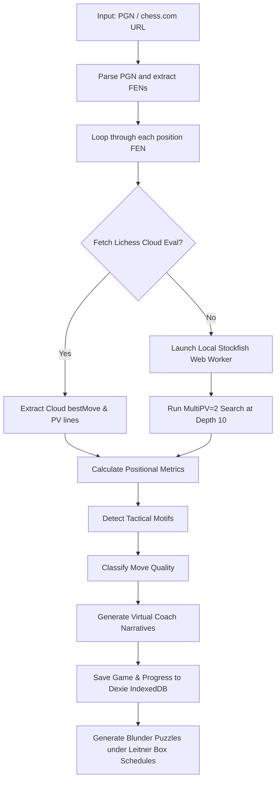

# ChessInsight Pro — Production Monorepo Documentation (v2.0)

ChessInsight Pro is an advanced web application for chess game analysis and interactive training designed to serve as **the Duolingo of Chess Improvement**. 

Rather than just displaying raw engine calculations, it focuses on explaining moves conceptually using virtual coach personalities, detecting player weaknesses over time, and generating interactive training puzzles from player blunders under spaced-repetition schedules.

---

## 🏗️ Monorepo Architecture Overview

The repository is organized as a high-performance monorepo using `pnpm` workspaces:

```
├── apps/
│   └── web/                         # Next.js 15 App Router UI, Zustand store, and Dexie storage
├── packages/
│   ├── core/
│   │   ├── chess/                   # Chess.js rules, PGN parsing wrappers, and move utilities
│   │   ├── engine/                  # Web Worker Stockfish WASM lifecycle providers (SF17 & SF18)
│   │   └── openings/                # ECO openings dictionary and lookup
│   ├── analysis/
│   │   ├── evaluator/               # Lichess win-chance calculations & cloud cache fetching
│   │   ├── positional/              # Tension, mobility, space control, and development metrics
│   │   ├── tactical/                # Fork, pin, sacrifice, check, and hanging piece detectors
│   │   ├── classifier/              # Centipawn-based move quality categorization
│   │   └── narrative/               # Multi-personality Virtual Coach storytelling engine
│   ├── player/
│   │   ├── profile/                 # Historic ELO curves, performance statistics, and accuracy
│   │   ├── weakness-detector/       # Aggregates move history for systemic error tracking
│   │   └── recommendations/         # Matches weaknesses to study programs
│   ├── training/
│   │   ├── puzzles/                 # Generates interactive training puzzles from game blunders
│   │   └── learning/                # Spaced repetition Leitner Box progression schedules
│   ├── visualization/
│   │   ├── charts/                  # Prepares data points for Recharts timelines
│   │   └── heatmaps/                # Calculates square-coordinate frequencies on chess boards
│   └── shared/
│       ├── types/                   # Unified TypeScript interfaces for the entire system
│       └── utils/                   # Bounding and platform utilities
├── scripts/                         # Build, deployment, and postinstall engine setup scripts
└── pnpm-workspace.yaml              # Workspace topology rules
```

---

## 🚀 Game Analysis Pipeline (Under the Hood)

When a player uploads a PGN or enters a chess.com game URL, the game analysis is processed step-by-step using a pipeline defined in `apps/web/src/app/pipeline.ts`:



### 1. Game Parsing
* **How it happens**: The game PGN is loaded, parsed, and sanitised using the `@chessinsight/chess-core` package.
* **What it does**: Extract headers (players, ELO, event, date), re-plays the moves in sequence, and extracts the list of FEN configurations and moves in UCI format (`from` square, `to` square, and any `promotion` piece).

### 2. Evaluation Fetching (Cloud / Local)
* **Cloud Cache**: First, the application attempts to fetch evaluations from the Lichess Cloud Evaluation API (`https://lichess.org/api/cloud-eval?fen=...&multiPv=2`). If successful, this saves cpu cycles and provides instant results.
* **WASM Fallback**: If the position is not cached, the application instantiates a background Web Worker running **Stockfish 17** or **Stockfish 18** WebAssembly engine to perform calculations without freezing the UI thread.
* **Double-PV Search (`MultiPV = 2`)**: The engine searches the top two moves at depth 10. This is necessary to compare the played move against the best alternative move.

### 3. Positional Metrics Calculation
Calculated in `@chessinsight/positional` using the Chess board layout:
* **Tension**: Number of capture moves available for both sides.
* **Mobility**: Number of legal moves available for non-pawn pieces.
* **Space Control**: Total number of squares controlled or attacked by each player's pieces.
* **Development**: Count of minor pieces (Knights, Bishops) and major pieces (Rooks, Queen) off their starting squares.

### 4. Tactical Motifs Detection
Calculated in `@chessinsight/tactical` using target square checks:
* **Fork**: A piece attacking two or more targets of higher or equal value.
* **Pin**: A piece that cannot move without exposing a more valuable piece behind it.
* **Hanging Piece**: Undefended pieces exposed to capture, or defended pieces attacked by lower-value pieces.
* **Skewer, Discovered Attack, Deflection, Decoy, Mating Net**: Standard tactical motifs computed from square control lists and piece values.

### 5. Move Quality Classification
Calculated in `@chessinsight/classifier` using win chance differences:
* Centipawn evaluations ($cp$) are converted to win percentages using the Lichess log-linear win chance coefficient: 
  $$\text{Win } \% = 50 + 50 \times \left( \frac{2}{1 + e^{-0.00368208 \times cp}} - 1 \right)$$
* Move quality is classified as:
  * **Brilliant**: A tactical sacrifice that maintains/improves the player's win chance.
  * **Great**: A move that changes the game outcome (e.g. from lost to draw/win) or is the only good move.
  * **Best**: The top line calculated by Stockfish.
  * **Excellent / Good**: Moves that lose very little win percentage.
  * **Inaccuracy**: Loss of $5\% - 10\%$ win percentage.
  * **Mistake**: Loss of $10\% - 20\%$ win percentage.
  * **Blunder**: Loss of $>20\%$ win percentage.
  * **Book / Forced**: Standard theoretical lines or single legal escape moves.

### 6. Narratives Generation
* **How it happens**: The `@chessinsight/narrative` package matches move quality and tactical facts against predefined narrative templates for 7 different coach personalities.
* **Personalities**:
  * **Professional**: Formal, objective analysis.
  * **Friendly**: Encouraging, supportive tips.
  * **Beginner**: Simplified chess rules and terms explanations.
  * **Roast**: Dry, sarcastic, and humorous comments.
  * **Positional**: Highlights space control, development, and structure.
  * **Tactical**: Details calculations, forks, and pins.
  * **Minimal**: Short and concise labels.

---

## 🎨 Feature Tour & Functionality

### 🧩 Puzzles
1. **Daily Puzzle (`/puzzles/daily`)**: Fetches the Lichess Daily Puzzle, sets up the board, and lets the player solve it. Opponent replies automatically. Correct moves play normal chess sounds, while wrong moves trigger custom error sounds.
2. **Puzzle Rush (`/puzzles/rush`)**: A fast-paced game mode where the player solves as many puzzles as possible from a 30-puzzle curated local database (`puzzle-db.ts`) in 3 minutes. The game ends when the timer expires or when the player makes 3 strikes (errors).
3. **Puzzle Battle (`/puzzles/battle`)**: A dual-progress battle where the player races against a bot (configurable ELO 800–2500) to solve the most puzzles in 3 minutes.
4. **Custom Puzzles (`/puzzles/custom`)**: Filter the local tactical puzzle collection by Theme (Fork, Pin, Mate in 1, Checkmate, Outpost, Removal, etc.) and Difficulty (Easy, Medium, Hard).

### 🎓 Learn
1. **Lessons (`/learn/lessons`)**: Interactive slides showing FEN arrangements on the board. Teaches **Fundamentals** (piece movements), **Strategy** (opening principles), **Tactics** (pins, forks, skewers, discovery), and **Endgames** (king activation, opposition).
2. **Play Coach (`/learn/play-coach`)**: Play an offline chess match against a local bot. Bot levels: Beginner (600 ELO), Intermediate (1200 ELO), and Advanced (1800 ELO). The coach offers randomized tips in a speech box on each move.
3. **Openings (`/learn/openings`)**: Interactive directory of the most common opening systems (Ruy Lopez, Sicilian Defense, Queen's Gambit, King's Indian, French, Caro-Kann) displaying Eco codes, win rates, main move branches, and key strategic ideas.
4. **Chess Terms (`/learn/terms`)**: Searchable index of 40 essential chess terms (Stalemate, Zugzwang, Zwischenzug, Fianchetto, En Passant, Gambit, etc.) with definitions.
5. **Rules (`/learn/rules`)**: Handbook explaining chess rules, including castling requirements, en passant captures, promotion, draws, and time controls.
6. **Coordinates Trainer (`/learn/coordinates`)**: Develop board notation recognition. 30-second rounds. Mode **Find Square** (user clicks a square based on text coordinate) or **Name Square** (user enters coordinate of highlighted square). Toggleable coordinates indicators.

### 🏋️ Train
1. **Analysis (`/analysis`)**: The core analyzer dashboard where players upload PGNs, adjust engine version (Stockfish 17 / 18), and read coach evaluations, positional graphs, and accuracy summaries.
2. **Endgames (`/train/endgames`)**: Essential endgame drills (King & Queen, King & Rook, Lucena Position, Philidor Position, key squares, opposition) with reset controls.
3. **Practice (`/train/practice`)**: Scenario sandbox options (Open Position, Closed Position, Complex Rook Endgame, Kingside Attack) or standard openings with rotating coaching advice.
4. **Sandbox (`/train/sandbox`)**: Free-play board with move navigation log (back/forward), board orientation toggle, and custom FEN string loader.

### ⚙️ Settings
* Switch engine selection between **Stockfish 17 WASM** and **Stockfish 18 WASM**.
* Interactive board theme selector with live previews. 
* Six curated visual themes:
  * **Classic Slate**: Slate blue and gray.
  * **Ocean Teal**: Dark teal and steel blue.
  * **Tournament Green**: Classical green and light beige.
  * **Dark Walnut**: Deep wood brown and cream.
  * **Royal Purple**: Violet and light purple.
  * **Arctic Ice**: Sky blue and ice white.
* Themes persist across sessions using Zustand store persistence (`zustand/persist`).

---

## 💾 Local Storage Schema (Dexie.js)

ChessInsight Pro uses browser IndexedDB via Dexie.js to work fully offline:

### `games`
* **Primary Key**: `id`
* **Indices**: `date`, `pgn`, `result`
* **Stores**: PGN strings, move logs, centipawn evaluations, tactical motifs, and generated coach narratives.

### `profiles`
* **Primary Key**: `playerId`
* **Stores**: Player ratings, ELO progression history, average centipawn loss (CPL) trends, and detected weaknesses.

### `learning`
* **Primary Key**: `conceptId`
* **Indices**: `box`, `nextReviewDate`
* **Stores**: Spaced-repetition card boxes (`Box 1` to `Box 5`), streaks, and review times.

---

## 🤖 Stockfish Web Worker Integration

Browser computations run Stockfish WebAssembly engines in dedicated workers:
* The `@chessinsight/engine` package loads the engine WASM bundle asynchronously.
* MultiPV is set to 2 to compute alternative variations.
* Single-threaded engines are used (`stockfish-17-lite-single.js` / `stockfish-18-lite-single.js`) to maximize performance in general browser environments.

---

## 🛠️ Installation & Setup

### Requirements
* Node.js (v18+)
* `pnpm` (v9+)

### 1. Clone & Install Dependencies
```bash
git clone https://github.com/prayingforthelastsunbeam/ChessInsightPro.git
cd ChessInsightPro
pnpm install
```

> [!NOTE]
> During `pnpm install`, a postinstall hook automatically runs `scripts/setup-engines.js` to assemble Stockfish 17 WebAssembly components (split to bypass GitHub's 100MB file limit).

### 2. Manual Engine Assembly (Optional)
If you need to assemble the WebAssembly engines manually:
```bash
pnpm run setup-engines
```

### 3. Build Packages (Topological Order)
Build shared packages before launching the app:
```bash
pnpm run build
```

### 4. Run Development Server
Start the Next.js dev server:
```bash
pnpm run dev
```
Open [http://localhost:3000](http://localhost:3000) to view the application.
