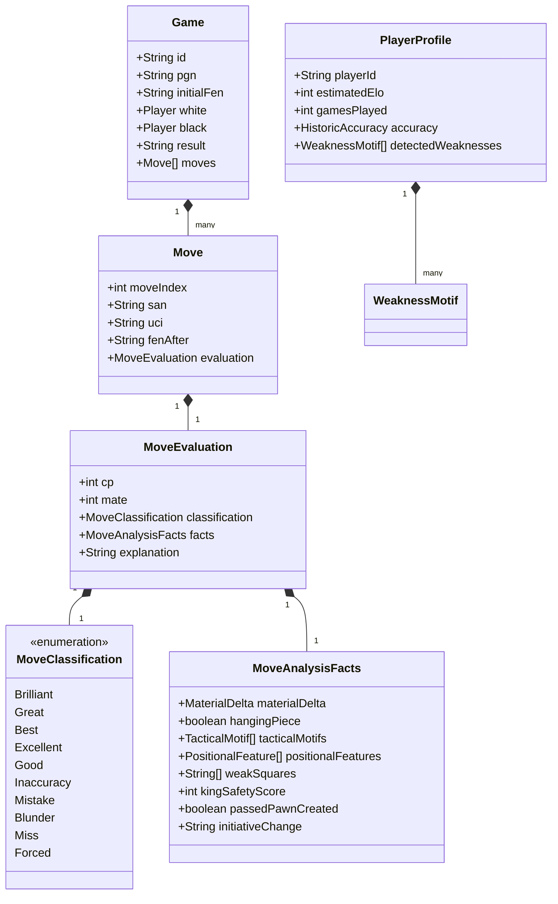
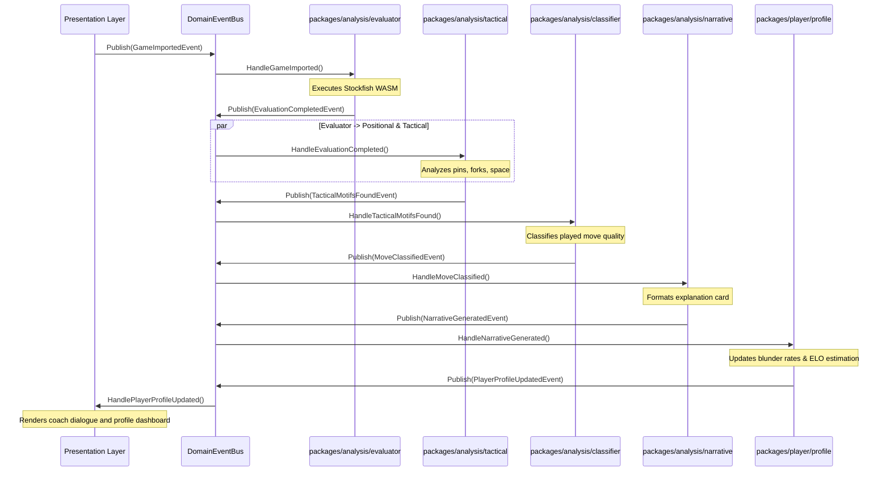
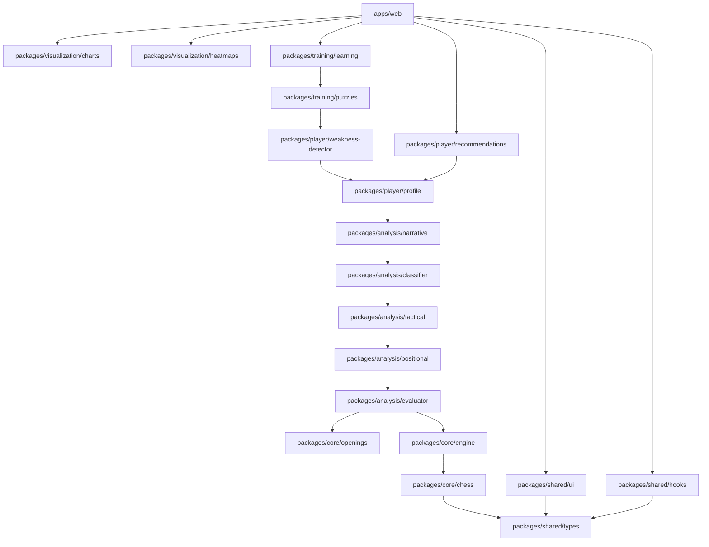
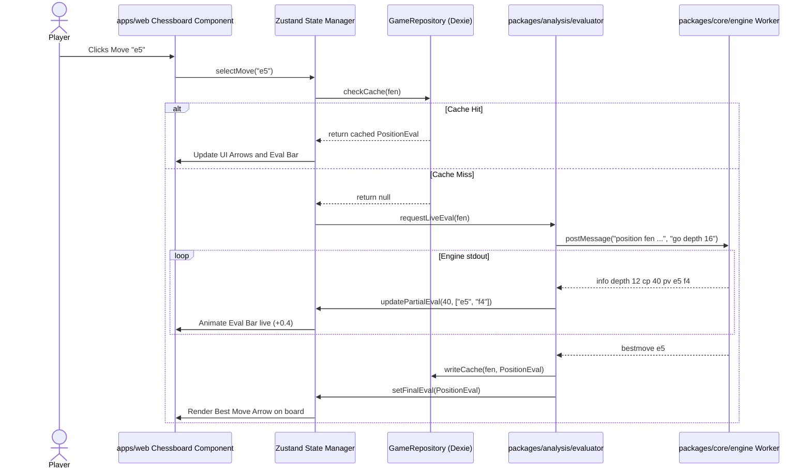
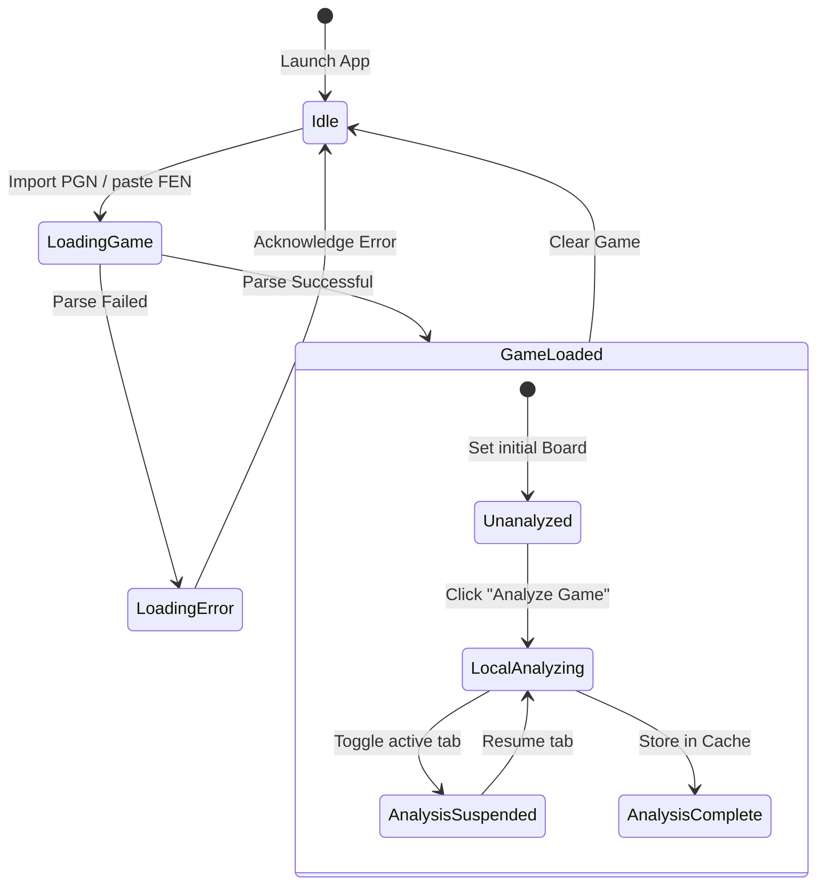

# Software Architecture Document (SAD) — ChessInsight Pro v2.0

## 1. Vision

ChessInsight Pro aspires to be **the Duolingo of Chess Improvement**. It shifts the paradigm of chess tools away from calculation engines (which are already commoditized) and toward **conceptual comprehension and active learning**. 

The goal is to demystify complex computer evaluations, bridging the gap between raw numeric outputs (e.g., `+1.4`, `MultiPV` listings) and human chess understanding (e.g., weak pawn structures, tactical motifs, king safety vulnerabilities). It provides an automated, conceptual, and highly personalized chess training system that learns from a user's games to eliminate recurring blind spots.

---

## 2. Product Philosophy

To compete with chess platforms like Chess.com, Lichess, Aimchess, and DecodeChess, ChessInsight Pro is designed around four key product differentiators:

1. **Active Concept Ingestion (Duolingo Model):** Instead of passive game reviews, the platform dynamically generates interactive quizzes based on the player's own blunders. It forces players to solve their critical positions under space-repetition schedules.
2. **Abstracted Virtual Coach Personalities:** Moves are explained by virtual personalities (Professional, Friendly, Beginner, Roast, Tactical, Positional, Minimal) suited to the player's rating level and emotional preference.
3. **Weakness Pattern Recognition:** The platform aggregates game metrics over time, identifying systemic habits rather than isolated blunders (e.g., "You miss knight forks 12% more often when under 2 minutes on the clock").
4. **Zero-Server Costs, Native Portability:** By leveraging browser-native WASM engines, IndexedDB, and decoupled core packages, players enjoy zero-latency analysis offline. The company incurs near-zero operational costs for computations, enabling a sustainable solo-developer business model.

---

## 3. Architectural Principles

* **Strict Framework Independence:** All chess logic, engine UCI interfaces, and analytics libraries are written as pure, framework-agnostic TypeScript modules. Next.js serves strictly as a presentation framework. This ensures that 80–90% of the codebase is reusable inside React Native (mobile), Electron/Tauri (desktop), or CLI scripts.
* **Domain-Driven Isolation:** Packages are defined around tight domain boundaries (e.g., separating position analysis from pattern detection) to avoid circular dependencies and simplify code navigation.
* **Dependency Inversion (Provider Abstractions):** Low-level details (such as local storage engines, AI APIs, and Stockfish workers) are accessed exclusively via TypeScript interfaces.
* **Unidirectional Pipeline Flow:** The game review is processed sequentially as a data pipeline, converting raw PGN text into structured chess models, evaluations, positional/tactical facts, classifications, and coach narratives.
* **Offline-First with Clean Cloud Sync:** The client operates fully self-contained using IndexedDB repository interfaces. If cloud sync is introduced later, a `SyncProvider` will synchronize the local repository with remote APIs in the background.

---

## 4. Domain Model



---

## 5. Monorepo Structure

The monorepo uses `pnpm workspaces` to manage dependencies and build targets cleanly.

```text
/
├── pnpm-workspace.yaml
├── package.json
├── turbo.json
├── apps/
│   └── web/                                 # Next.js App Router Presentation Layer
└── packages/
    ├── core/
    │   ├── chess/                           # Game model, FEN/SAN validation, rules wrapper
    │   ├── engine/                          # Stockfish WASM wrapper, PV parser, UCI controller
    │   └── openings/                        # ECO book directory and tactical opening plans
    ├── analysis/
    │   ├── evaluator/                       # Converts centipawns/mates to win probabilities
    │   ├── positional/                      # Analyzes space, outposts, pawn structures, files
    │   ├── tactical/                        # Pattern detector: forks, pins, traps, hanging pieces
    │   ├── classifier/                      # Assigns move quality categories
    │   └── narrative/                       # Custom text explanation/Coach engine
    ├── player/
    │   ├── profile/                         # Historic record player profiles
    │   ├── statistics/                      # Average CPL, accuracy, phase-by-phase calculations
    │   ├── weakness-detector/               # Spotting repetitive positional & tactical mistakes
    │   └── recommendations/                 # Recommends training path options
    ├── training/
    │   ├── learning/                        # Spaced-repetition & interactive study courses
    │   ├── puzzles/                         # Custom puzzle loader based on blunders
    │   └── exercises/                       # Endgames and opening drill routines
    ├── visualization/
    │   ├── charts/                          # Recharts abstraction layer
    │   └── heatmaps/                        # Board square heatmap calculations
    └── shared/
        ├── types/                           # Common domain interfaces
        ├── ui/                              # Core UI components
        ├── hooks/                           # Framework-agnostic hooks
        ├── utils/                           # General helper functions
        └── config/                          # Workspace lint/compile settings
```

---

## 6. Package Responsibilities

Below is the detailed specification for the packages inside the monorepo:

### 6.1 `packages/core/chess`
* **Purpose:** Encapsulates the chess game model and rules.
* **Responsibilities:**
  - Initialize and maintain game states via `chess.js` wrappers.
  - Parse PGN strings into JSON game models; export SAN and FEN strings.
  - Track captured pieces, material balances, castling rights, and legal move queries.
* **Public API:**
  - `class GameModel`: Wraps `chess.js` to manage move history and custom variations.
  - `function parsePgn(pgn: string): ParsedGame`: Ingests raw PGN and parses headers and moves.
  - `function getMaterialDifference(fen: string): number`: Computes raw centipawn material score.
* **Dependencies:** `chess.js` (npm), `packages/shared/types`
* **Must NOT Know About:** Stockfish, Web Workers, browser DOM, local databases, or UI.
* **Why it exists separately:** Rules of chess are immutable. Keeping them decoupled prevents compilation dependencies from changing when updating engine heuristics.

### 6.2 `packages/core/engine`
* **Purpose:** Interfaces directly with chess engines (e.g., Stockfish).
* **Responsibilities:**
  - Launch, monitor, and query Stockfish workers via standard UCI commands.
  - Support `MultiPV` line queries, threads settings, and memory allocations.
  - Parse raw UCI stdout lines into typed evaluation outputs.
* **Public API:**
  - `interface EngineInstance`: Start/stop engine, set options, queue positional analyzes.
  - `function parseUciLine(line: string): EngineLine`: Transforms raw text into depth, score (CP/Mate), and pv-moves.
* **Dependencies:** `packages/shared/types`
* **Must NOT Know About:** Next.js, IndexedDB, rendering code, or coach narrative systems.
* **Why it exists separately:** Allows swapping Stockfish 17 WASM with Stockfish 18 WASM, a native engine binary, or a remote engine API, without touching game rules or analysis code.

### 6.3 `packages/core/openings`
* **Purpose:** Identifies openings and maps typical plans.
* **Responsibilities:**
  - Match FEN strings against the ECO opening database.
  - Return names, typical middlegame plans, tactical motifs, and common mistakes for matched lines.
* **Public API:**
  - `function lookupOpening(fen: string): OpeningDetails | null`
  - `function getBookMoves(fen: string): BookMove[]`
* **Dependencies:** `packages/shared/types`
* **Must NOT Know About:** Web workers or user statistics.
* **Why it exists separately:** The opening database is large (~300KB+ JSON). Keeping it in its own package allows lazy loading, minimizing bundle sizes for the main application bundle.

### 6.4 `packages/analysis/evaluator`
* **Purpose:** Orchestrates position evaluations and converts engine scores into win/loss probabilities.
* **Responsibilities:**
  - Execute cloud evaluation fallbacks (e.g. Lichess API) before spinning up Stockfish workers.
  - Standardize centipawns and mate-in-N values into human-relatable win-chances (0-100%) using ceiled logistic regressions.
* **Public API:**
  - `function calculateWinChance(cp: number, mate?: number): number`
  - `class PositionEvaluator`: Resolves evaluations using local caches, cloud fallbacks, or the engine.
* **Dependencies:** `packages/core/engine`, `packages/shared/types`
* **Must NOT Know About:** Next.js or PGN formatting.
* **Why it exists separately:** Separates math modeling (Lichess win chance formulas) from hardware engine control.

### 6.5 `packages/analysis/positional`
* **Purpose:** Extracted feature engine evaluating static positional elements.
* **Responsibilities:**
  - Analyze pawn structures: passed pawns, isolated pawns, doubled pawns, pawn islands.
  - Identify outposts, open/semi-open files, weak squares, king safety danger scores, and piece mobility deltas.
* **Public API:**
  - `function analyzePositionalFeatures(fen: string): PositionalReport`
* **Dependencies:** `packages/core/chess`, `packages/shared/types`
* **Must NOT Know About:** Stockfish engine instances or narrative generation.
* **Why it exists separately:** Positional rules are static and mathematical. Decoupling them allows evaluating board positions instantly without engine analysis overhead.

### 6.6 `packages/analysis/tactical`
* **Purpose:** Identifies tactical patterns (motifs).
* **Responsibilities:**
  - Detect forks, pins, skewers, trapped pieces, discovered attacks, and deflection threats.
  - Compare move alternatives to detect missed tactics.
* **Public API:**
  - `function detectTacticalMotifs(fenBefore: string, move: string, fenAfter: string): TacticalMotif[]`
* **Dependencies:** `packages/core/chess`, `packages/shared/types`
* **Must NOT Know About:** Multi-threaded engines or local storage.
* **Why it exists separately:** Restricts the package to rule-based geometric chess calculations, allowing standard testing against fixed chess puzzles.

### 6.7 `packages/analysis/classifier`
* **Purpose:** Classifies move qualities based on changes in win probabilities.
* **Responsibilities:**
  - Calculate win percentage drops between the best move and the played move.
  - Assign categories (Brilliant, Great, Best, Excellent, Good, Inaccuracy, Mistake, Blunder, Miss, Forced).
* **Public API:**
  - `function classifyMove(playedWinChance: number, bestWinChance: number, isForced: boolean, isSacrifice: boolean): MoveClassification`
* **Dependencies:** `packages/shared/types`
* **Must NOT Know About:** HTML structures or PGN text.
* **Why it exists separately:** Keeps move classification algorithms decoupled, enabling developers to tune blunder ranges without changing game models.

### 6.8 `packages/analysis/narrative`
* **Purpose:** Formats conceptual reviews from chess facts.
* **Responsibilities:**
  - Ingest `MoveAnalysisFacts` (move type, motifs, material delta, safety shifts).
  - Map facts to templates based on selected `CoachStyle` (Roast, Professional, Friendly, etc.).
* **Public API:**
  - `class NarrativeGenerator`: Formats move summaries using the configured `ExplanationProvider`.
* **Dependencies:** `packages/shared/types`
* **Must NOT Know About:** Stockfish processes or canvas rendering.
* **Why it exists separately:** Decoupled coach logic can easily be swapped for localized templates, custom sound clips, or remote LLM integrations.

---

## 7. Data Flow

The data flow is structured as a strict pipeline:

```text
[Input: Raw PGN Text]
        │
        ▼ (packages/core/chess)
[Parsed Game Object: Headers, Moves Array]
        │
        ▼ (packages/analysis/evaluator)
[Evaluated Game: FENs + Stockfish Scores]
        │
        ▼ (packages/analysis/positional & tactical)
[Position & Tactical Facts: Forks, Outposts, Hanging Pieces]
        │
        ▼ (packages/analysis/classifier)
[Classified Game: Moves assigned Blunder, Great, Brilliant]
        │
        ▼ (packages/analysis/narrative)
[Coached Game: Text explanations added in selected style]
        │
        ▼ (packages/player/profile & statistics)
[Updated Player Profile & Statistics]
        │
        ▼ (packages/player/recommendations)
[Recommended Exercises & Lessons List]
        │
        ▼
[Output: UI Presenter in apps/web]
```

---

## 8. Event Flow

We implement a Domain Event Architecture to keep packages loosely coupled. A central `DomainEventBus` fires events at key lifecycle steps, letting separate packages respond asynchronously:



---

## 9. Dependency Graph

To prevent architectural regression, the package dependencies are structured strictly bottom-up:



---

## 10. Sequence Diagrams

### Interactive Move Exploration & Live Engine Analysis

This sequence describes a player clicking on a square to view candidate lines in the evaluation bar:



---

## 11. State Diagrams

### Game Analysis Session Lifecycle



---

## 12. Storage Architecture

We design ChessInsight Pro around an **Offline-First Storage Engine** using IndexedDB (abstracted via Dexie.js). 

```text
                   ┌───────────────────────────┐
                   │   Presentation UI Layer   │
                   └─────────────┬─────────────┘
                                 │
                     Uses Repository Interface
                                 │
                                 ▼
                   ┌───────────────────────────┐
                   │    Repository Registry    │
                   └─────────────┬─────────────┘
                                 │
                   ┌─────────────┴─────────────┐
                   │                           │
                   ▼                           ▼
       ┌───────────────────────┐   ┌───────────────────────┐
       │ DexieLocalRepository  │   │ PostgresCloudRepo     │
       │ (IndexedDB / Offline) │   │ (Cloud Sync / Online) │
       └───────────┬───────────┘   └───────────┬───────────┘
                   │                           │
                   ▼                           ▼
             Local Storage                GraphQL / REST
```

### Dexie Repository Implementation

```typescript
import Dexie, { Table } from "dexie";
import { Game, GameRepository } from "@chessinsight/types";

class ChessInsightDatabase extends Dexie {
  games!: Table<Game, string>;

  constructor() {
    super("ChessInsightDb");
    this.version(1).stores({
      games: "id, date, result, white.name, black.name",
    });
  }
}

export class DexieGameRepository implements GameRepository {
  private db = new ChessInsightDatabase();

  async getGame(id: string): Promise<Game | null> {
    return (await this.db.games.get(id)) || null;
  }

  async saveGame(game: Game): Promise<void> {
    await this.db.games.put(game);
  }

  async deleteGame(id: string): Promise<void> {
    await this.db.games.delete(id);
  }

  async getAllGames(): Promise<Game[]> {
    return this.db.games.toArray();
  }
}
```

---

## 13. Engine Architecture

The engine controller implements the **Dependency Inversion Principle**, decoupling engine execution from specific Stockfish compilations:

```typescript
export interface EngineProvider {
  initialize(): Promise<void>;
  evaluatePosition(fen: string, depth: number, multiPv: number, onUpdate?: (line: EngineLine[]) => void): Promise<EngineLine[]>;
  stop(): void;
  terminate(): void;
}
```

Supported providers:
* `StockfishWasmProvider`: Uses Web Workers to load JS/WASM assemblies inside the browser client.
* `CloudEngineProvider`: Evaluates positions using external APIs (e.g. Lichess Cloud Evaluation) to save user CPU cycles.
* `StockfishNativeProvider`: Uses native TCP/IPC connections for local desktop platforms (Tauri/Electron).

---

## 14. Explanation Architecture

To support offline templates and optional premium AI reviews, narrative generation uses an abstraction interface:

```typescript
export interface ExplanationProvider {
  explainMove(facts: MoveAnalysisFacts, style: CoachStyle): Promise<string>;
}
```

### Local Template Explanation Provider
Generates immediate, localized conceptual critiques based on rule-based templates. This guarantees the application works fully offline with zero latency.
```typescript
export class TemplateExplanationProvider implements ExplanationProvider {
  async explainMove(facts: MoveAnalysisFacts, style: CoachStyle): Promise<string> {
    if (facts.moveType === MoveClassification.Blunder && facts.hangingPiece) {
      if (style === CoachStyle.Roast) {
        return "Nice blunder. Your piece is hanging on that square and can be taken for free. Try looking at the whole board next time!";
      }
      return "This is a blunder because it leaves your piece undefended on a square attacked by the opponent.";
    }
    return "This move maintains a solid position.";
  }
}
```

### LLM Explanation Provider (Optional/Cloud)
An online provider that sends facts to a serverless API (OpenAI/Gemini), returning highly contextualized critiques.
```typescript
export class LlmExplanationProvider implements ExplanationProvider {
  async explainMove(facts: MoveAnalysisFacts, style: CoachStyle): Promise<string> {
    const response = await fetch("/api/coach/explain", {
      method: "POST",
      body: JSON.stringify({ facts, style }),
    });
    const data = await response.json();
    return data.explanation;
  }
}
```

---

## 15. Player Profile Architecture

Historic metrics are compiled over time to detect systemic weaknesses.

### Player Statistics Struct
```typescript
export interface PlayerProfile {
  playerId: string;
  accuracyTrend: number[];       // Accuracy over the last 20 games
  averageCplTrend: number[];     // Centipawn loss over time
  motifWeaknesses: Record<TacticalMotif, number>; // Maps motif failures (e.g., Fork -> 12 misses)
  openingAccuracy: Record<string, number>;        // Accuracy scores mapped to ECO codes
}
```

### Weakness Detector
```typescript
export class WeaknessDetector {
  detectSystemicIssues(games: Game[]): WeaknessReport[] {
    const reports: WeaknessReport[] = [];
    // 1. Gather all blunders
    // 2. Identify the tactical motifs associated with those blunders
    // 3. Flag patterns (e.g., if >15% of blunders are due to missed back-rank mates)
    return reports;
  }
}
```

---

## 16. Learning Architecture

We implement a conceptual learning framework modeled after spaced repetition:

```typescript
export interface ConceptProgress {
  conceptId: string; // e.g. "KnightFork"
  box: number;       // Leitner box index (1 to 5)
  nextReviewDate: Date;
  correctStreak: number;
}
```

When the `WeaknessDetector` flags a systemic issue, the `LearningEngine` prioritizes interactive lessons and puzzle drills targeting that specific concept, accelerating structural retention.

---

## 17. Training Architecture

The puzzle engine extracts blunder coordinates from the player's historic games database to generate personalized puzzles:

```typescript
export class BlunderPuzzleGenerator {
  generatePuzzleFromBlunder(game: Game, blunderMoveIndex: number): Puzzle {
    const move = game.moves[blunderMoveIndex];
    const boardStateBeforeBlunder = game.moves[blunderMoveIndex - 1].fenAfter;
    const correctAlternativeMove = move.evaluation.facts.bestAlternativeMove; // UCI format

    return {
      id: `blunder-${game.id}-${blunderMoveIndex}`,
      initialFen: boardStateBeforeBlunder,
      solutionMoves: [correctAlternativeMove],
      hint: `In the actual game, you played ${move.san}. Find the better move instead!`,
    };
  }
}
```

---

## 18. Plugin Architecture

To support future extensibility, ChessInsight Pro exposes hooks for third-party extensions:

```typescript
export interface ChessInsightPlugin {
  id: string;
  name: string;
  onGameLoaded?(game: Game): void;
  onAnalysisCompleted?(game: Game, evaluation: GameEval): void;
  extendUIElements?(): Record<string, React.ComponentType>;
}
```

Developers can register plugins that add custom evaluation graphs, sound packs, or alternative visual layouts.

---

## 19. Offline-First Architecture

Offline-first functionality is achieved through clear architectural separation:

1. **Storage Decoupling:** Local read/writes hit IndexedDB immediately.
2. **Local Engines:** Stockfish WASM compiles and evaluates games directly on the client machine.
3. **PWA Service Worker:** Caches application bundle, piece SVGs, styles, and engine JS scripts locally.

---

## 20. Future Cloud Architecture

When a user upgrades to a premium cloud subscription, local IndexedDB transactions queue synchronization tasks:

```typescript
export interface SyncQueueItem {
  id: string;
  action: "UPSERT" | "DELETE";
  dataType: "game" | "profile" | "settings";
  payload: any;
  timestamp: number;
}
```

Background sync loops send queued events to backend Postgres/Prisma services, resolving conflicts using a **Last-Write-Wins (LWW-Element-Set) CRDT** strategy.

---

## 21. Mobile Architecture

Because all business logic sits in framework-agnostic TypeScript packages under `packages/`, a React Native / Expo application can share approximately 80–90% of the code:

```text
┌────────────────────────────────────────────────────────┐
│                     Shared Core                        │
│  (chess-core, engine, openings, evaluator, positional,  │
│  tactical, classifier, narrative, profile, learning)   │
└──────────────────────────┬─────────────────────────────┘
                           │
             ┌─────────────┴─────────────┐
             ▼                           ▼
   ┌───────────────────┐       ┌───────────────────┐
   │    apps/web       │       │    apps/mobile    │
   │  (Next.js App)    │       │  (React Native)   │
   ├───────────────────┤       ├───────────────────┤
   │ - Tailwind CSS    │       │ - React Native    │
   │ - Recharts        │       │ - Native SVG      │
   │ - Dexie (Web)     │       │ - SQLite / Expo   │
   └───────────────────┘       └───────────────────┘
```

---

## 22. Security Considerations

* **Sandboxed Execution:** Stockfish runs exclusively inside Web Workers, preventing cross-site scripting (XSS) privilege escalations.
* **Input Sanitization:** Raw PGN parsing uses strict regular expression validation to prevent prototype pollution or database injection vectors before saving to IndexedDB.
* **Offline Privacy:** Sensitive game evaluations and user analytics are stored locally on-device.

---

## 23. Performance Strategy

* **Lighthouse Target:** Keep JavaScript bundles under 150KB (gzip) for the initial route. Lazy-load heavy dependencies (such as the opening ECO catalog database or engine WASM files).
* **Frame Rates:** Chessboard moves and arrow renders must resolve within 16ms (60 FPS).
* **Evaluation Speed:** Prioritize cloud database caches for position lookups, only running Stockfish WASM when cache misses occur.

---

## 24. Testing Strategy

We enforce testing thresholds across our decoupled domains:

1. **`packages/core/*`:** Enforce 100% unit test coverage using **Vitest**. Validate PGN parsing against complex master game files containing annotations and variations.
2. **`packages/analysis/tactical` & `positional`:** Test using fixed chess puzzle suites (FEN inputs and expected motif detections).
3. **End-to-End (`apps/web`):** Run **Playwright** tests verifying game uploads, move click navigation, and engine settings adjustments.

---

## 25. Deployment Strategy

* **Edge Network Host:** Vercel or Cloudflare Pages for instant CDN delivery of assets (including Stockfish WASM scripts).
* **Assets Cache Headers:** Engine JS and WASM files utilize aggressive, long-term cache headers (`Cache-Control: public, max-age=31536000, immutable`).

---

## 26. Roadmap

```text
Phase 1: Core Foundation & Monorepo Restructuring
 └── Initialize pnpm workspaces, define compiler configs
 └── Create packages/core/chess and packages/core/engine

Phase 2: Positional & Tactical Analysis Pipeline
 └── Implement packages/analysis/tactical and packages/analysis/positional
 └── Build packages/analysis/evaluator and classifier

Phase 3: Coach Narrative Engine
 └── Implement packages/analysis/narrative (CoachStyle and TemplateExplanationProvider)

Phase 4: Player Profile & Blunder Puzzles
 └── Build packages/player/profile and packages/player/weakness-detector
 └── Implement packages/training/puzzles (generating exercises from blunder positions)

Phase 5: Premium Presentation Layer & Dashboard UI
 └── Scaffold apps/web using Next.js App Router, Tailwind CSS, Zustand, and Dexie
 └── Integrate charts and board timelines
```

---

## Critical Self-Evaluation

### 1. High Package Granularity vs. Build Complexity
* *Trade-off:* Having 15+ sub-packages in a monorepo increases developer configuration complexity (managing `package.json` linkages, build pipelines, tsconfigs).
* *Alternative:* A monolithic structure is simpler initially.
* *Justification:* Because our goal is to build an Android/iOS app in Expo alongside the web app, a monolithic core makes sharing code difficult. Reusable package boundaries ensure the mobile app runs identical chess logic with zero code duplication.

### 2. IndexedDB vs. Remote SQL Cache
* *Trade-off:* Local IndexedDB storage limits access to a single device (desktop browser has no knowledge of mobile records).
* *Alternative:* Sync everything to a remote cloud DB immediately.
* *Justification:* Storing evaluations locally keeps our server operational cost near zero. We accept the local limitation initially, planning a background CRDT synchronization engine for a future premium phase.

### 3. Local WASM Execution vs. Serverless Stockfish REST Heuristics
* *Trade-off:* Local WASM runs on user CPU, which can drain battery on mid-range mobile devices during deep analyzes.
* *Alternative:* Run evaluations on a remote cloud server.
* *Justification:* Cloud computing for Stockfish is highly CPU-intensive and does not scale cheaply. Running client-side WASM combined with aggressive Lichess Cloud Evaluation cache lookups minimizes battery drain while keeping the service free.
